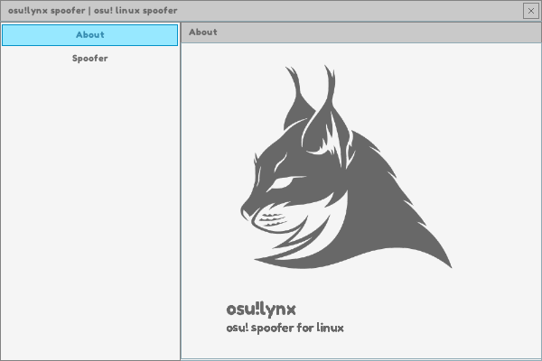
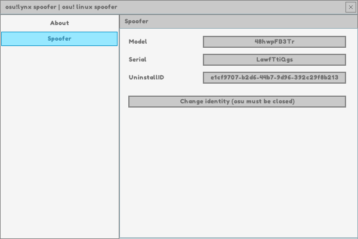

# osu!lynx spoofer

This is just a proof of concept spoofer for osu! game.
It is working and undetected as of 7 january 2023.

> I give no guarantee that this will work for a long time, since its easy to find ways to detect the presence of Wine.


## Getting started

I included a compiled binary of wine-osu that modifies the **Disk Serial** and **Disk Model** according to a string read from a file located in **C:/identity.txt**.

I tested this only on Manjaro 22.

Make sure you have no other osu-winello install.

To install open your terminal and:

1. Clone this repository
2. `cd ./package/osu-winello`
3. `chmod +x ./osu-winello.sh`
4. `./osu-winello.sh`
5. Install.

After install is successfull, create a file called `identity.txt` in `/home/.local/share/wineprefixes/osu-wineprefix/drive_c` and just edit it with two string separated by space ex: `Model Serial`.

Final step (pathing your wine-osu):

1. Copy the `wine-osu` folder from `/package/`
2. Go to `/home/.local/share/osuconfig`
3. Remove that `wine-osu` and paste the one from `/package/`.


You're pretty much done.

To test if everything is working fine just open your terminal.

```
osu-wine --cmd
```

then

```
wmic diskdrive get serialnumber
```

if it's the value in `identity.txt`, you're good to go.


## Spoofing

To spoof, just modify the values in `identity.txt` and in registry `HKCU/Software/osu!/` UninstallID.

But you can do this with GUI.

## GUI

To make it easier, just install Node 16.16.0 on your machine.

cd to the project directory

```
npm install
```

then
```
npm run dev
```







This runs on raylib's raygui.

Just press randomize, restart osu and make sure it asks you to verify your identity.

## You're spoofed


